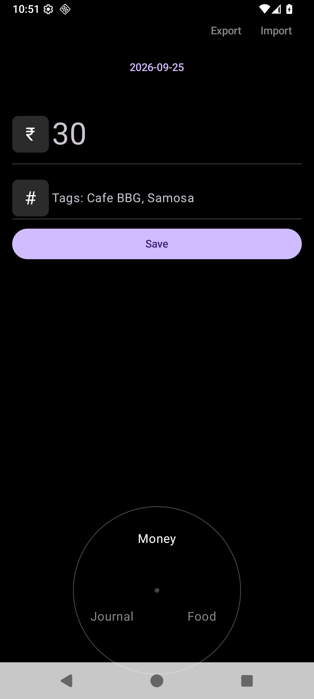
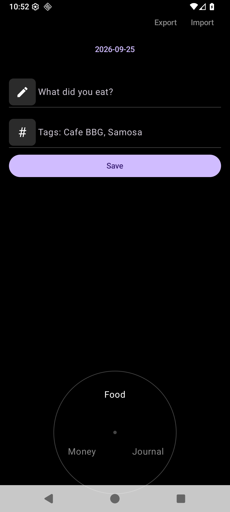
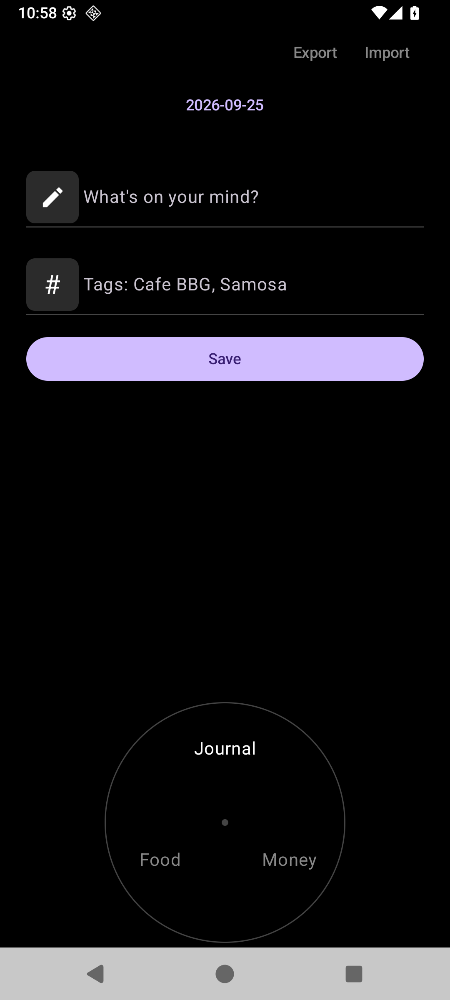

# Tout

Instant, offline expense / food / journal tracking for Android. Opens straight into the entry field — no login, no sync, no waiting. Three journals on a rotary dial, one tap to save, JSON out for analysis on your computer.

| Money | Food | Journal |
|---|---|---|
|  |  |  |

## Why

* **Loads instantly** — single Activity, zero init on start, no DI / DB / network. Cold start ~300–500ms.
* **Frictionless entry** — date defaults to today, Enter saves, dial switches journal. Center dot jumps focus to the entry field.
* **Yours** — append-only `entries.jsonl` on device. Export / import the same file via the system share sheet. No account, no cloud.
* **Fix mistakes** — Entries sheet (list icon, top left) to review, edit, or delete anything.

## Data

One JSON object per line (`entries.jsonl`):

```json
{"id":"…","ts":1758768000000,"date":"2026-09-25","type":"money","amount":30.0,"text":null,"tags":["Cafe BBG","Samosa"]}
{"id":"…","ts":1758768100000,"date":"2026-09-25","type":"food","amount":null,"text":"Masala dosa","tags":[]}
```

`type` is `money` | `food` | `note`. Import validates every line, skips bad ones, dedupes by `id` — an exported file re-imports cleanly.

## Build

Prereqs: JDK 17+, Android SDK with platform 35.

```sh
just build    # ./gradlew :app:assembleDebug
just test     # unit tests (parser + dial math + PhonePe route)
just install  # install on attached device / emulator
```

SDK location is read from `local.properties` (`sdk.dir=…`) or `ANDROID_HOME`.

## Notes

* **PhonePe button** (Money tab, only if installed): fires PhonePe's own Scan & Pay route (`phonepe://native?id=scanQR`, traced from its long-press shortcut) with a home-screen fallback.
* **Icon**: Lucide `notebook-pen` on pure black, adaptive + legacy mipmaps.
* Started from the hand-drawn wireframe in [`app.png`](app.png).
* Two source files: `MainActivity.kt` (UI) + `Store.kt` (storage/export/import).
